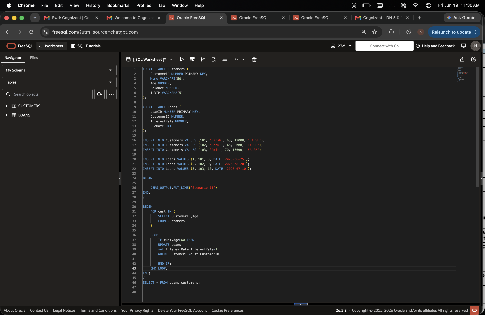
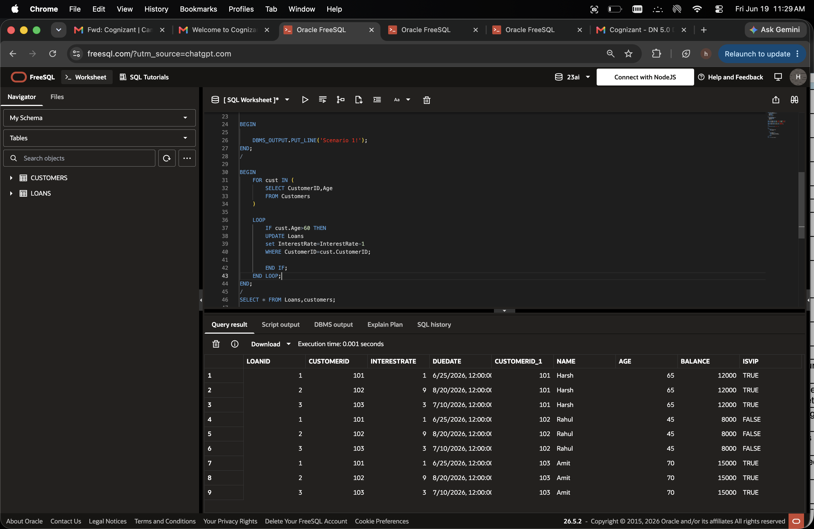
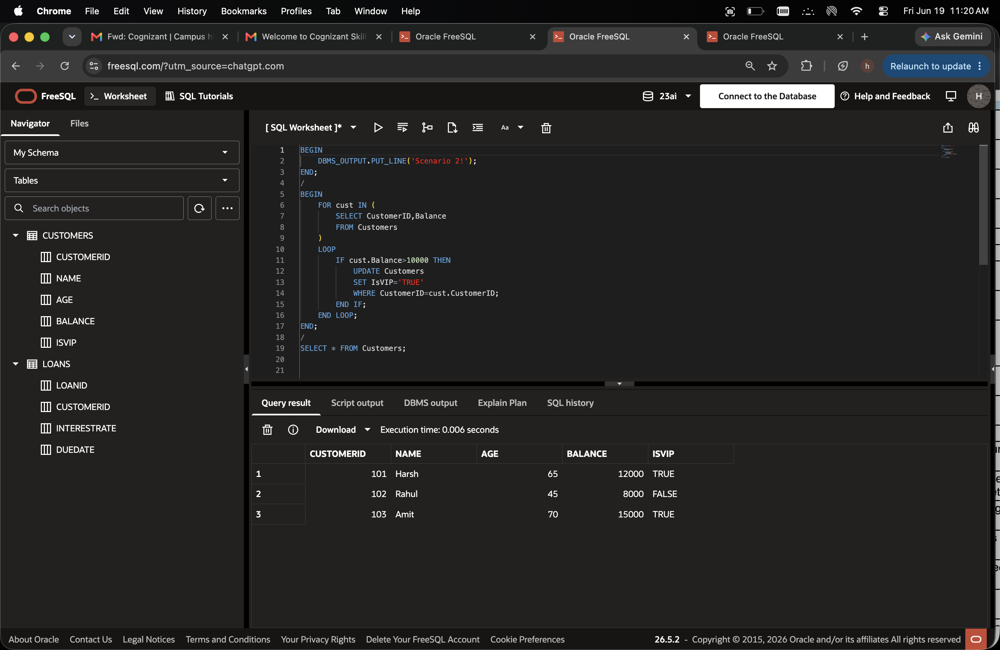
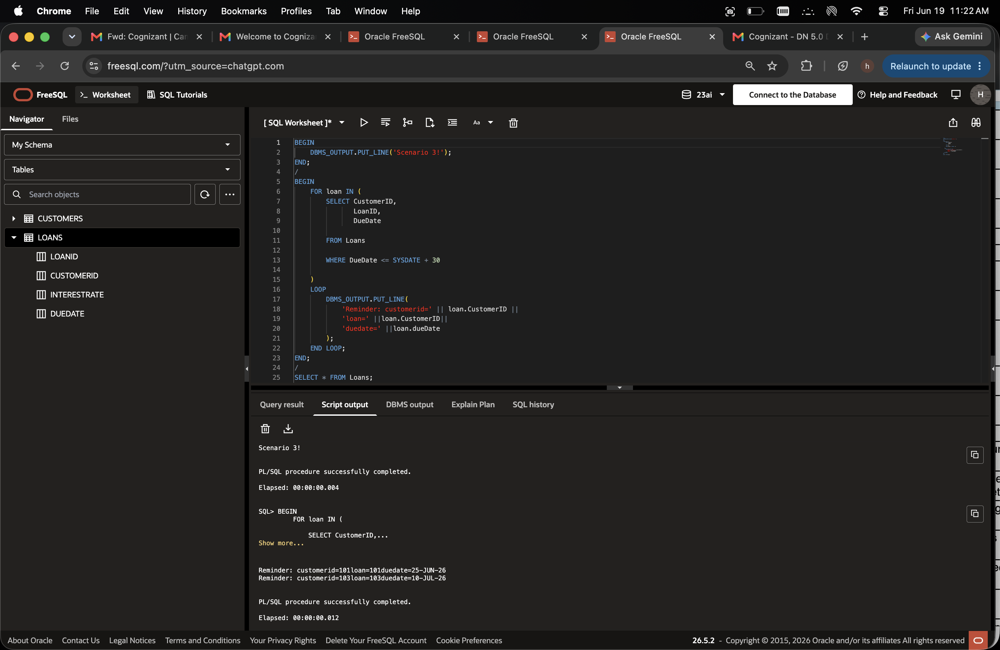
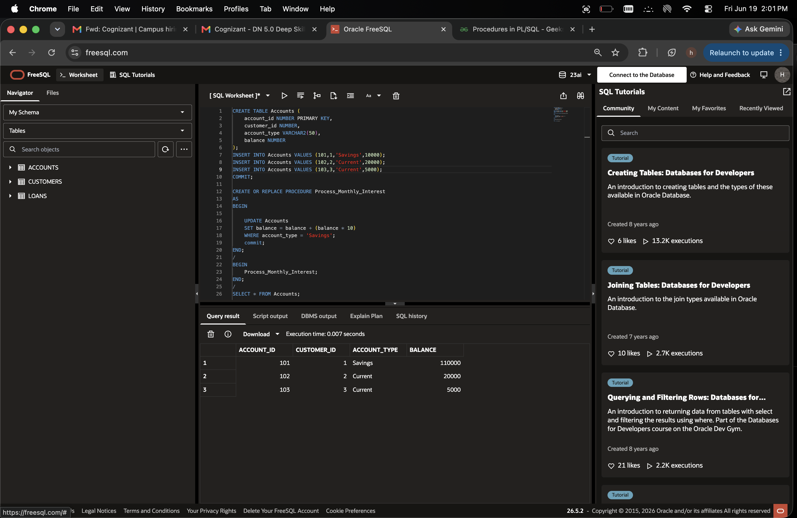
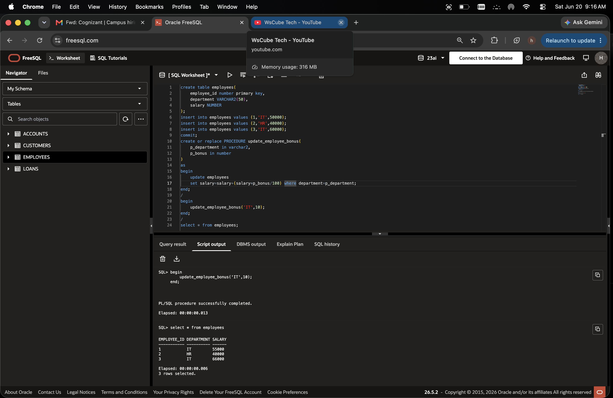
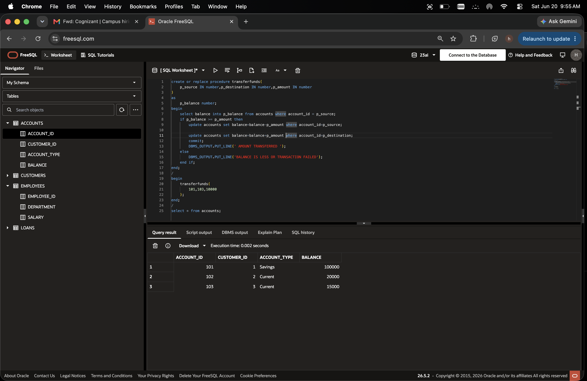

# PL/SQL Programming
**Target dates:** 19–25 Jun 2026

## 📝 Exercises Solved
- [x]  1 — Exercise 1: Control Structures
- [x]  2 — Exercise 3: Stored Procedures

## code:
## Exercise 1.

# scenario 1.

# 📸 Screenshots / Output

# scenario 2.

# scenario 3.

## Exercise 3.
# scenario 1.

# scenario 2.

# scenario 3

