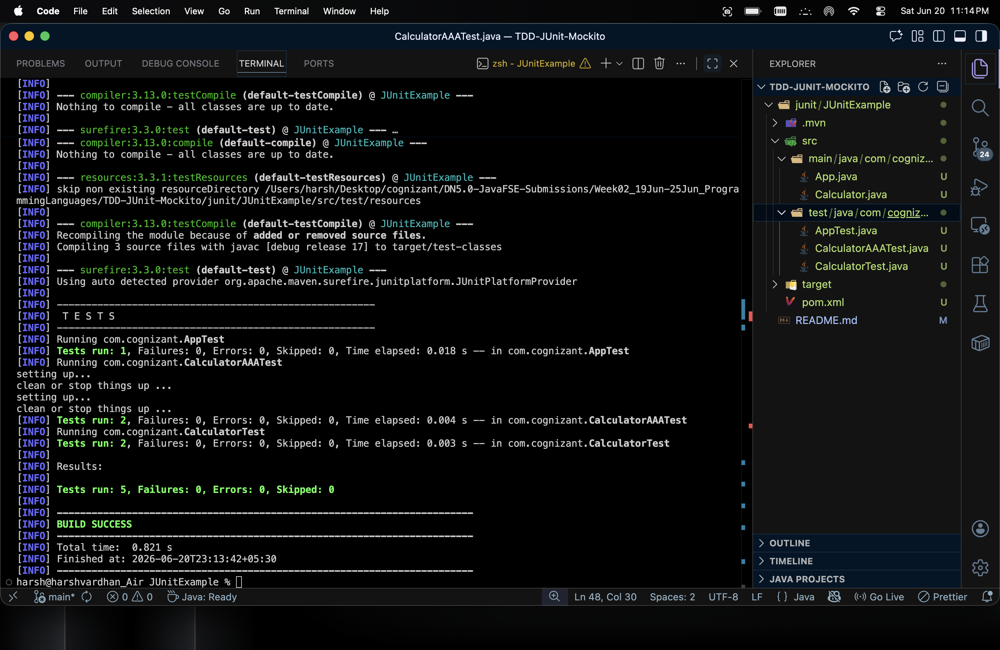

# TDD with JUnit5 & Mockito
**Target dates:** 19–25 Jun 2026

## 📝 Exercises Solved
- [x] Exercise 1: Setting Up JUnit
- [x] Exercise 2: Writing Basic JUnit Tests
- [x] Exercise 3: Assertions in JUnit
- [x] Exercise 4: Arrange-Act-Assert (AAA) Pattern, Test Fixtures, Setup and Teardown Methods in JUnit

## 📸 Screenshots / Output:

