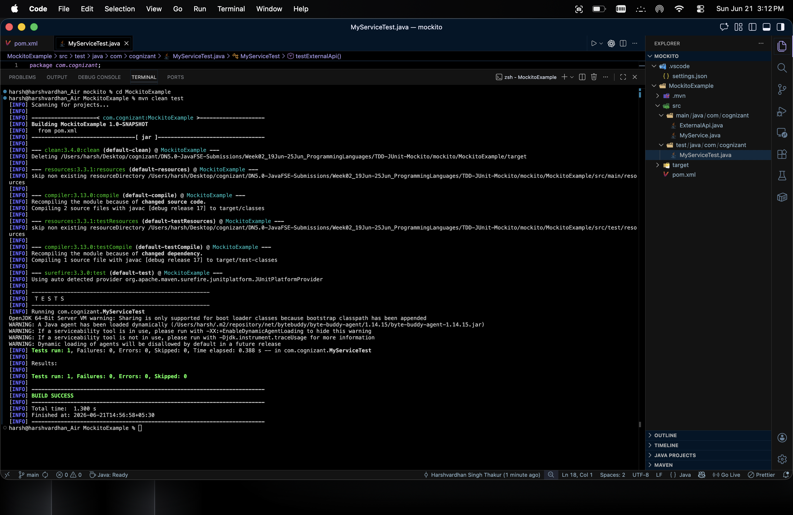
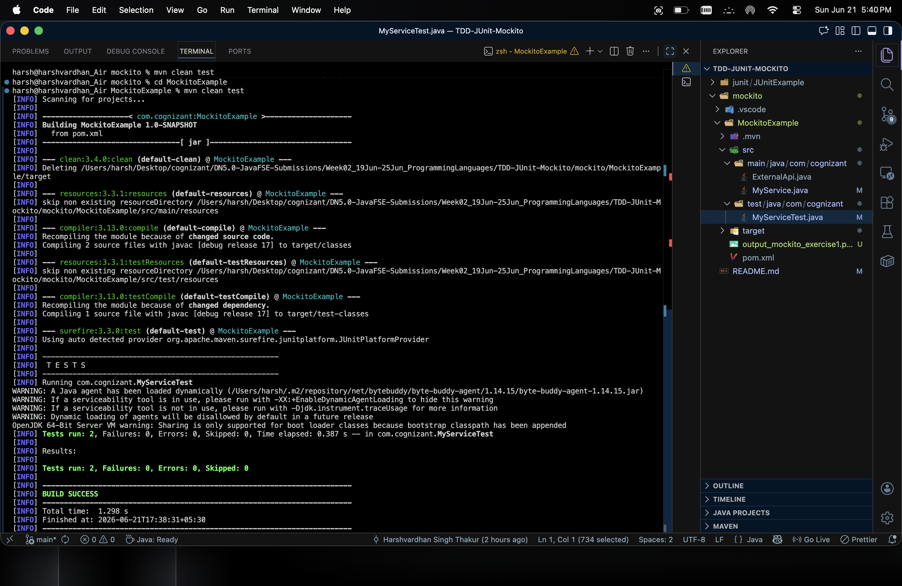

# TDD with JUnit5 & Mockito
**Target dates:** 19–25 Jun 2026

## 📝 Exercises Solved

# JUNIT
- [x] Exercise 1: Setting Up JUnit
- [x] Exercise 2: Writing Basic JUnit Tests
- [x] Exercise 3: Assertions in JUnit
- [x] Exercise 4: Arrange-Act-Assert (AAA) Pattern, Test Fixtures, Setup and Teardown Methods in JUnit

# mockito
- [x] Exercise 1: Mocking and Stubbing
- [x] Exercise 2: Verifying Interactions
# SL4J
- [] Exercise 1: Logging Error Messages and Warning Levels

## 📸 Screenshots / Output:

# junit-exercise 1,3,4

# mockito
exercise 1

exercise 2

# SL4J