# React Basics — Day Exercises

## 📝 Exercises Solved

- [x] ReactJS_HOL_1 Hands-On
- [x] ReactJS_HOL_2 Hands-On
- [x] ReactJS_HOL_3 Hands-On
- [x] ReactJS_HOL_4 Hands-On
- [ ] ReactJS_HOL_5 Hands-On

- [x] ReactJS_HOL_9 Hands-On
- [x] ReactJS_HOL_10 Hands-On
- [x] ReactJS_HOL_11 Hands-On
- [x] ReactJS_HOL_12 Hands-On
- [ ] ReactJS_HOL_13 Hands-On

---

# 📸 Screenshots / Output

## ReactJS_HOL_1 Hands-On

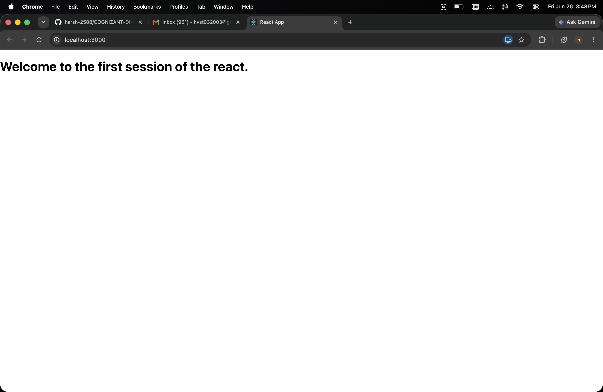

### Theory Questions & Answers

#### 1. Define SPA and its benefits

A **SPA (Single Page Application)** loads a single HTML page and dynamically updates content without reloading the entire page.

**Examples:**
- Gmail
- Facebook
- Instagram
- Netflix

**Benefits:**
- Faster navigation
- Better user experience
- Less server load
- No full-page refresh

---

#### 2. Define React and identify its working

React is an **open-source JavaScript library** used for building interactive user interfaces using reusable components.

---

#### 3. Identify the differences between SPA and MPA

| SPA | MPA |
|-----|-----|
| Loads a single page | Loads multiple pages |
| Fast navigation | Slower navigation |
| Does not reload the entire page | Reloads the entire page |
| Better user experience | Traditional websites |

---

#### 4. Explain the Pros & Cons of Single Page Applications

### Pros
- Fast performance
- Smooth user experience
- Less bandwidth usage
- Better responsiveness
- Reusable components

### Cons
- Higher initial loading time
- Larger bundle size for complex applications
- SEO (Search Engine Optimization) can be challenging

---

#### 5. Define Virtual DOM

The **Virtual DOM** is a lightweight copy of the Real DOM.

- React creates a Virtual DOM whenever data changes.
- It compares the new Virtual DOM with the previous one.
- Only the changed parts are updated in the Real DOM.
- This improves application performance.

---

#### 6. Explain the Features of React

- Component-based architecture
- JSX (JavaScript XML)
- Virtual DOM
- One-way data binding
- Reusable components
- High performance
- Easy integration with other libraries

---

## ReactJS_HOL_2 Hands-On


# Theory Questions & Answers

## 1. What is a React Component?

A **React Component** is a reusable piece of UI that returns JSX and can be used multiple times in an application.

### Example

```jsx
function Home() {
    return <h1>Home</h1>;
}
```

---

## 2. Difference Between React Components and JavaScript Functions

| React Component | JavaScript Function |
|-----------------|---------------------|
| Returns JSX | Returns any value |
| Used to build UI | Used for general programming logic |
| First letter is uppercase | Any naming convention |
| Rendered using `<Component />` | Called using `functionName()` |

---

## 3. Types of Components

React provides two types of components:

- Function Components
- Class Components

---

## 4. Function Component

A **Function Component** is a JavaScript function that returns JSX.

### Example

```jsx
function Home() {
    return <h1>Home</h1>;
}
```

---

## 5. Class Component

A **Class Component** extends `React.Component` and must implement the `render()` method.

### Example

```jsx
import React, { Component } from "react";

class Home extends Component {
    render() {
        return <h1>Home</h1>;
    }
}
export default Home;
```

---

## 6. Component Constructor

A **constructor** initializes the state and binds methods in a class component.

### Example

```jsx
constructor(props) {
    super(props);
}
```

---

## 7. render() Function

The **render()** method returns the JSX that will be displayed on the screen.

### Example

```jsx
render() {
    return <h1>Hello React</h1>;
}
```

---

# Output

The application displays the following components:

- Welcome to the Home page of Student Management Portal
- Welcome to the About page of Student Management Portal
- Welcome to the Contact page of Student Management Portal


## ReactJS_HOL_3 Hands-On
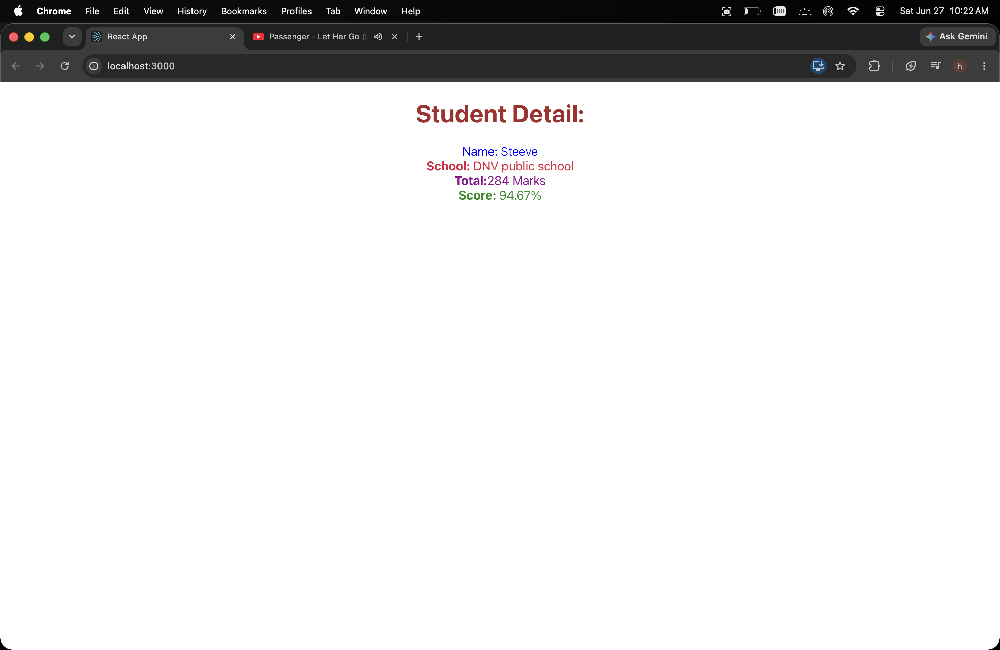

## ReactJS_HOL_4 Hands-On
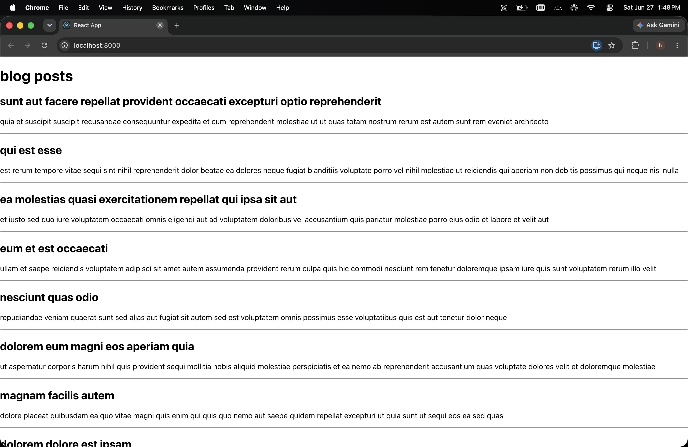


## ReactJS_HOL_5 Hands-On


## ReactJS_HOL_9 Hands-On
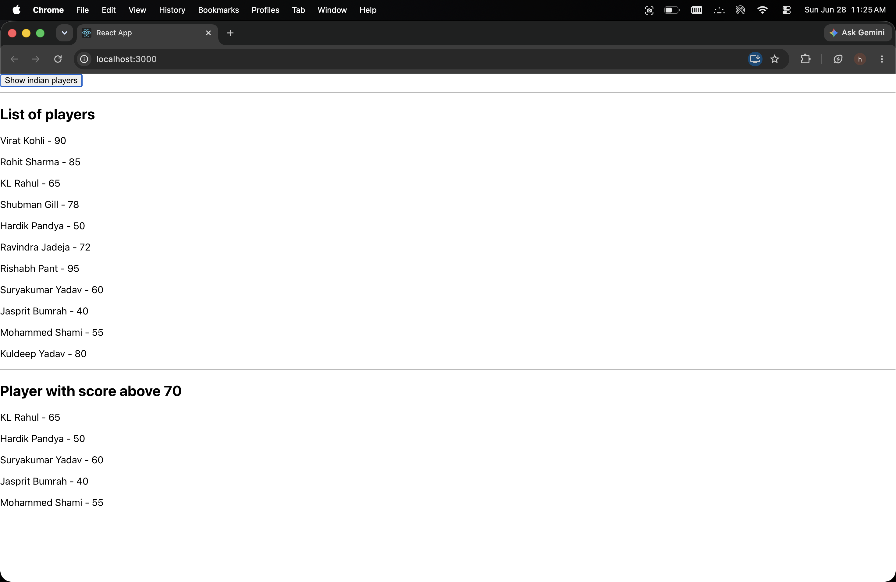
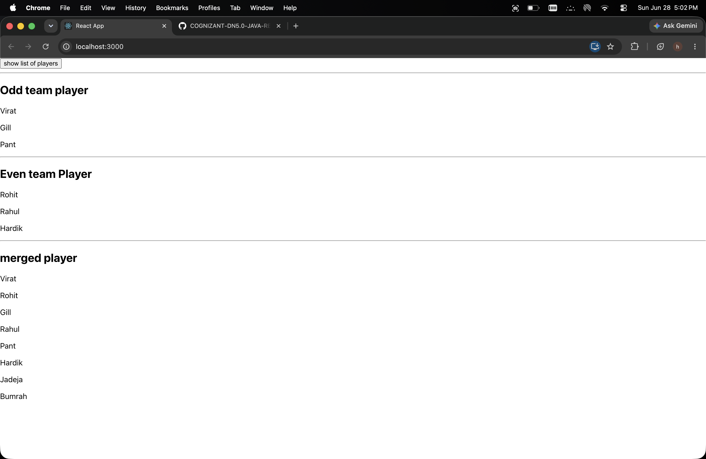


## ReactJS_HOL_10 Hands-On
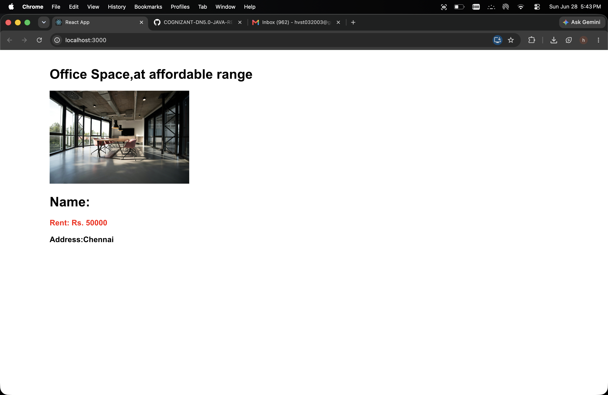

## ReactJS_HOL_11 Hands-On
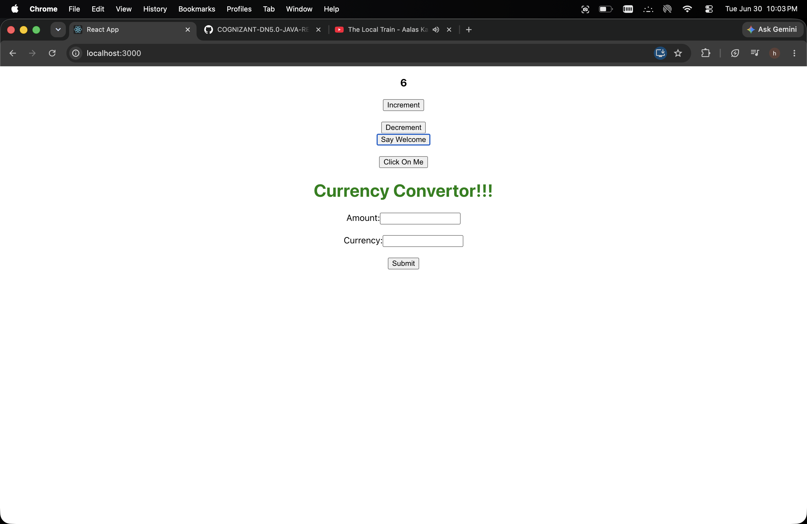

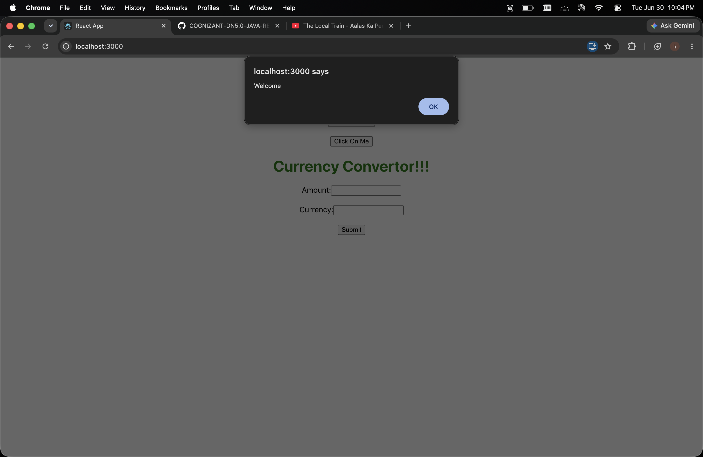
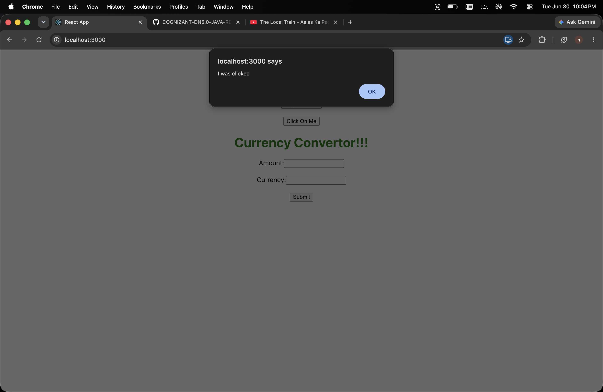
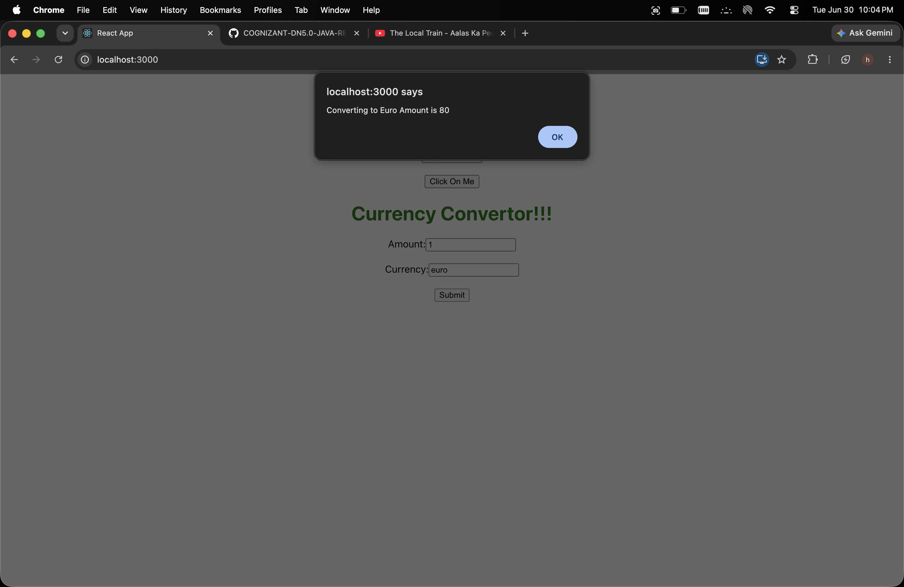


## ReactJS_HOL_12 Hands-On
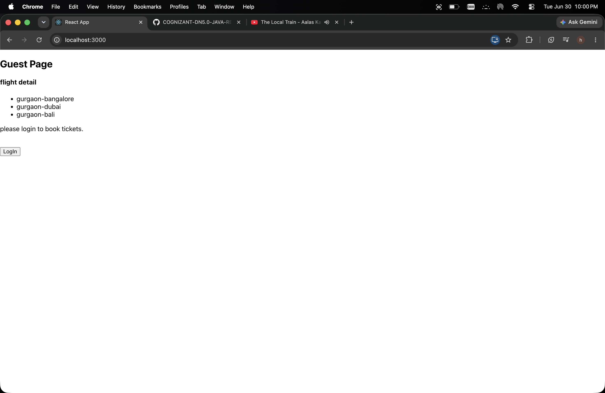
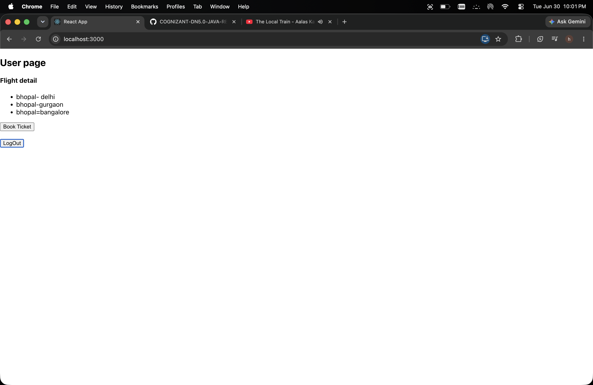
