# Git Version Control Exercises
**Target dates:** 24–30 Jul 2026

** I can't use some of the provided tools like p4merge and git bash,since I'm a macbook user.And these tools are not available for macbook.

## 📝 Exercises Solved
- [x] 1. Git-HOL
- [x] 2. Git-HOL
- [x] 3. Git-HOL
- [ ] 4. Git-HOL
- [ ] 5. Git-HOL

## 📸 Screenshots / Output (if applicable)

### GIT_HOL_1

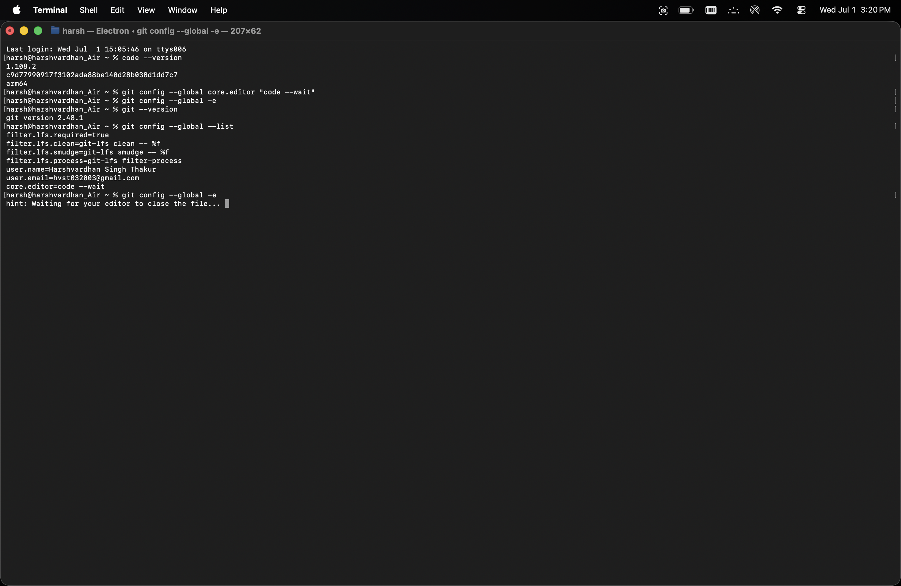
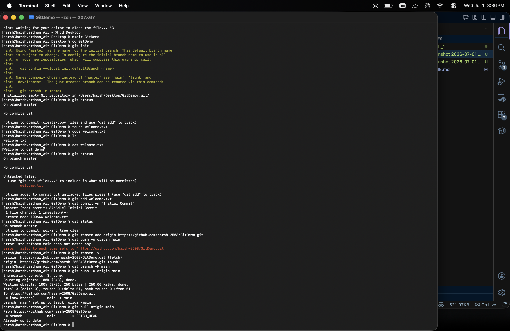

### GIT_HOL_2
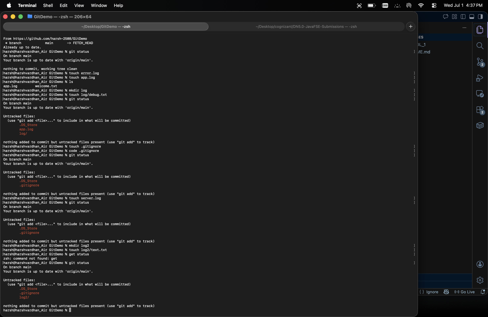
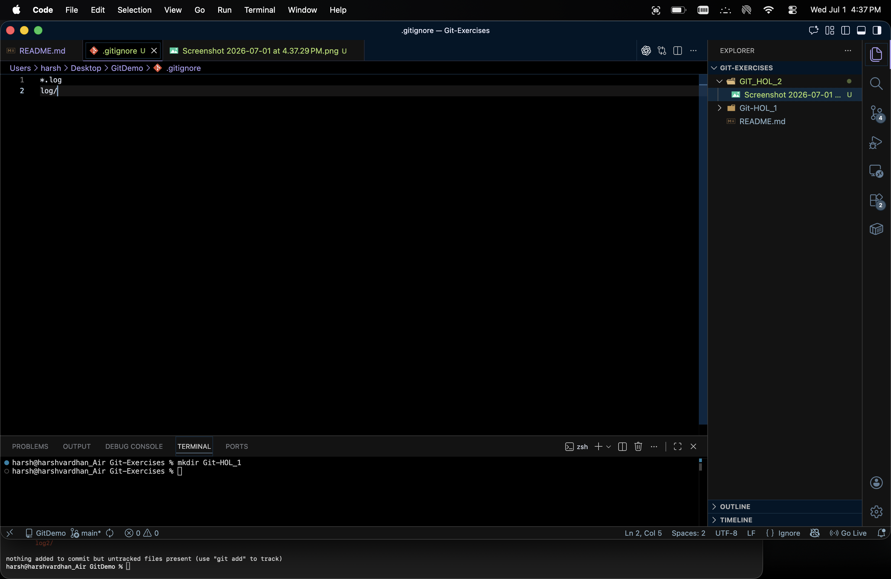

### GIT_HOL_3
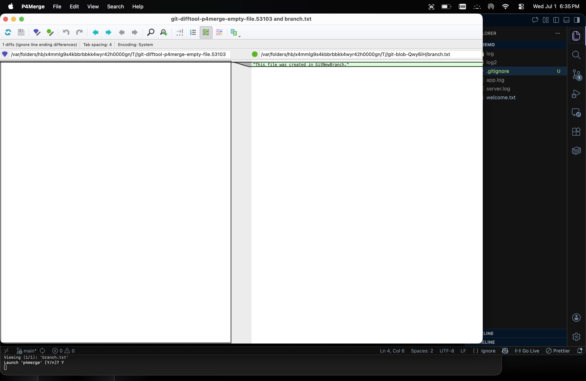
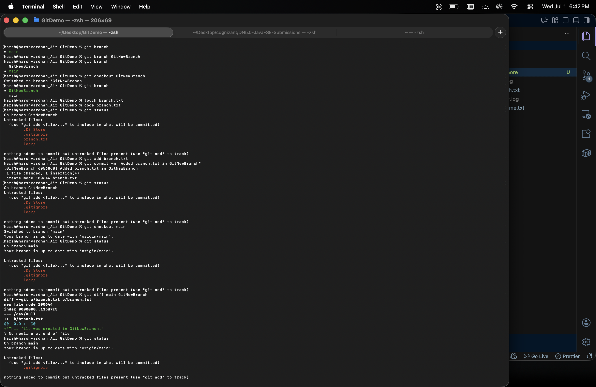
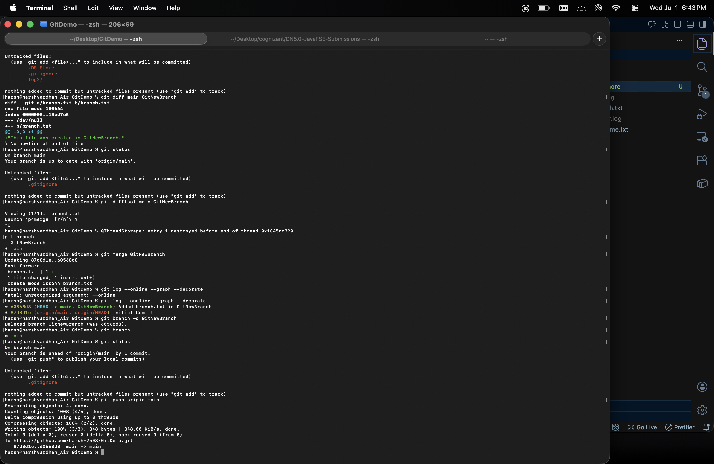

### GIT_HOL_4
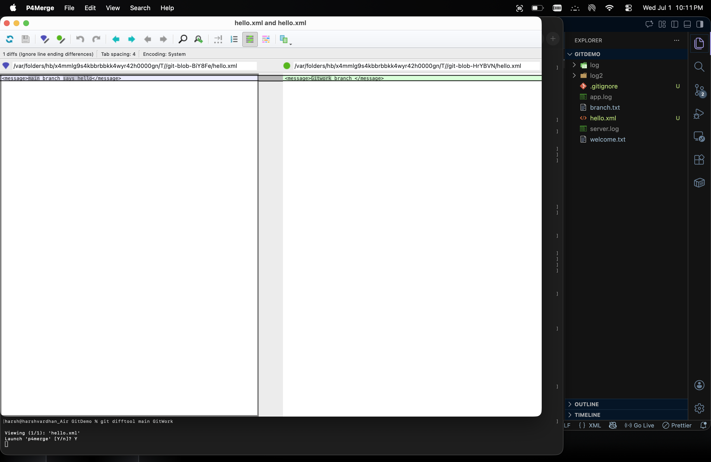
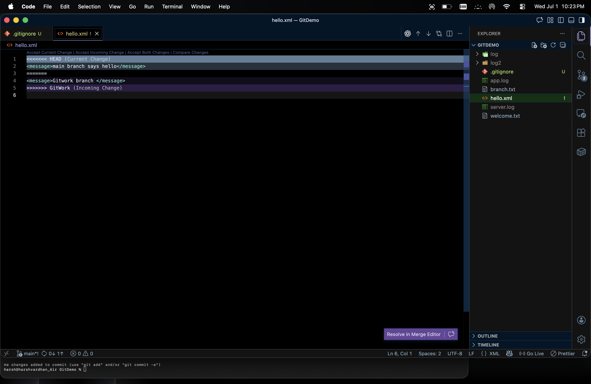
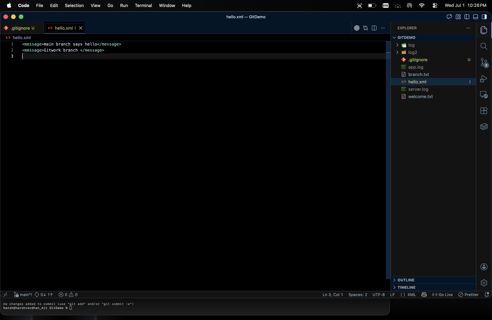
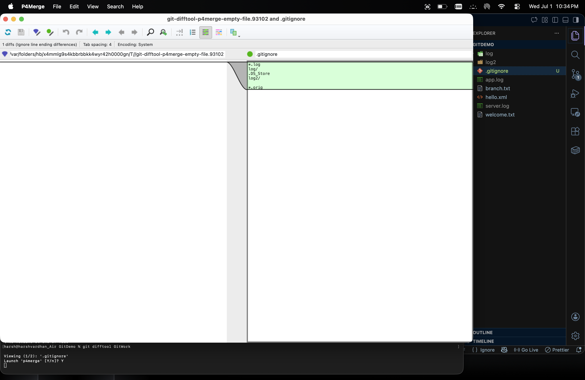
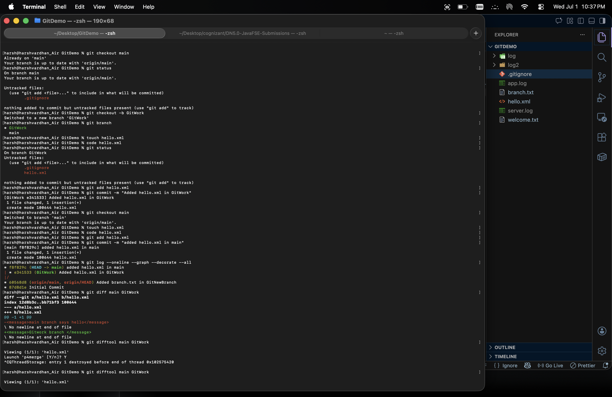
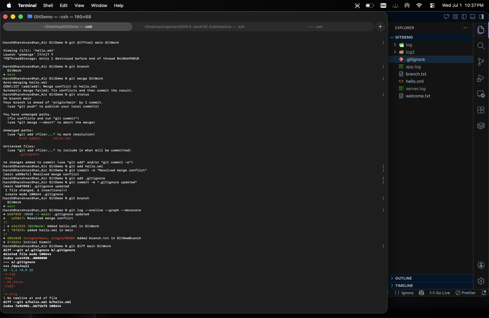
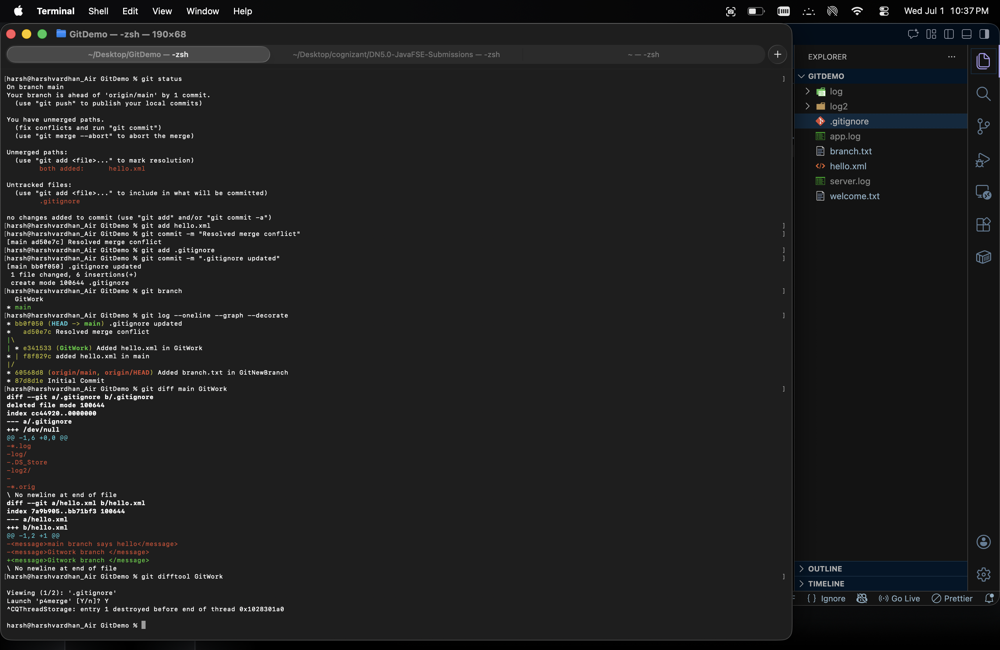

### GIT_HOL_5

